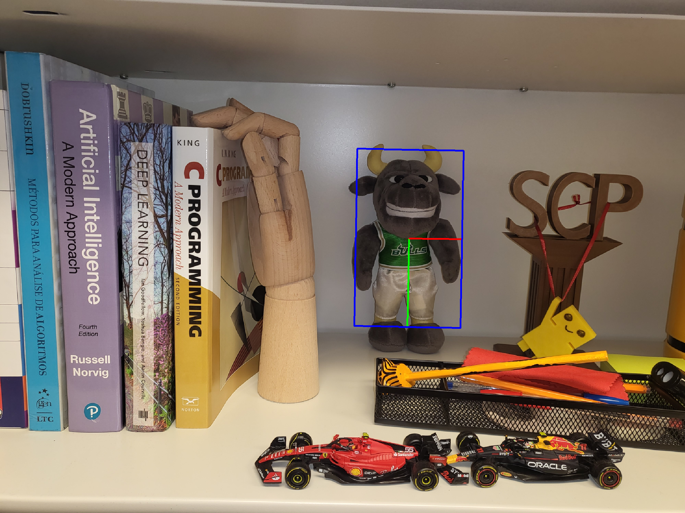

# Mascot Finder

## Description
This project finds the location, scale, and rotation of a university mascot ("Rocky") in various images. It uses classical computer vision techniques to match keypoints between a reference image and a test image, implementing a RANSAC algorithm to find a robust affine transformation.

## Demo

*(A sample output generated by the `draw.py` script on a test image.)*

---

## How It Works
The detection pipeline follows these steps:
1.  **Feature Detection:** **SIFT** (Scale-Invariant Feature Transform) is used to detect keypoints and compute descriptors for both the reference and test images.
2.  **Keypoint Matching:** A custom, vectorized brute-force matcher compares descriptors using Euclidean distance. **Lowe's ratio test** is applied to filter out ambiguous matches.
3.  **Transformation Estimation (RANSAC):** A **RANSAC** (Random Sample Consensus) algorithm is implemented from scratch to find the best affine transformation matrix that maps the reference keypoints to the test image, robustly handling outliers.
4.  **Bounding Box Calculation:** The corners of the reference image are transformed using the best matrix to determine the final oriented bounding box of the mascot in the test image.

---

## Usage
Follow these steps to run the code and visualize the results.

### 1. Find the Mascot
The main script, `finder.py`, will process an image and calculate the bounding box coordinates.

* **To test a different image**, open `finder.py` and edit the following line with the path to your test image:
    ```python
    img = cv2.imread('./tests/1.png', cv2.IMREAD_COLOR) # Change the filename here
    ```
* Run the script from your terminal:
    ```bash
    python finder.py
    ```
* This will print the results (`X Y H A`) to the console and also save them to a file named `output.txt`.

### 2. Visualize the Bounding Box
Use the provided `draw.py` script to see your result visually. This script reads the coordinates from the `output.txt` file you just created.

* Run the following command in your terminal. **Make sure the filename for the `-f` flag is the same one you used in `finder.py`**.
    ```bash
    python draw.py -f ./tests/1.png -a output.txt
    ```
* A window will pop up showing the image with the calculated bounding box drawn on it.
